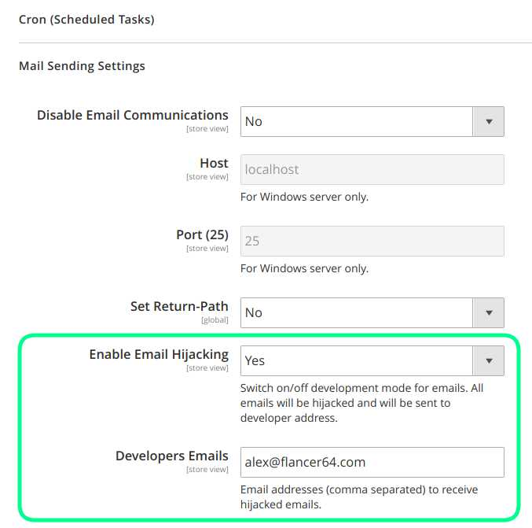

# mage2_ext_email_hijack

Hijack all emails being sent by Magento and forward its to developers.

This module allows to intercept all emails being sent by Magento 2 and redirect to developers email addresses.
Original addresses are converted into recipient names:
* _0_Customer First::cust1.at.gmail.com Customer Second::cust2.at.mail.com <dev1@mail.com>
* _1_Customer First::cust1.at.gmail.com Customer Second::cust2.at.mail.com <dev2@mail.com>


## Configuration
 
Go to `Store / Configuration / Advanced / System`:
 



## Install

### From console

```bash
$ cd ${DIR_MAGE_ROOT}   // go to Magento 2 root folder ('composer.json' file should be placed there)
$ composer require flancer32/mage2_ext_email_hijack
$ bin/magento module:enable Flancer32_EmailHijack
$ bin/magento setup:upgrade
$ bin/magento setup:di:compile

```

### Using 'composer.json'

```json
{
  "require": {
    "flancer32/mage2_ext_email_hijack": "*"
  }
}
```
